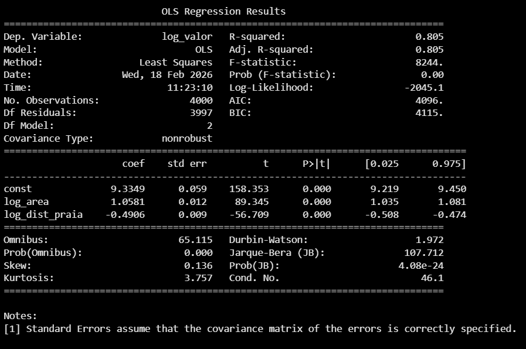
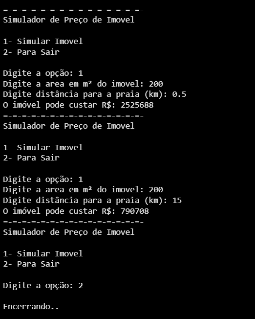

# Análise de Regressão Linear para Preço de Imóveis

Este notebook contém uma análise completa de regressão linear para prever o preço de imóveis, utilizando um dataset que inclui informações como valor, área, distância da praia e distância da farmácia `dataset.csv` .

Gráficos como boxplots, histogramas e pairplots são utilizados para visualizar a distribuição das variáveis, especialmente do preço ('Valor'), e identificar possíveis outliers e a natureza das relações entre as variáveis.

## 1. Carregamento e Exploração Inicial dos Dados
## 2. Visualização dos Dados Brutos

## 3. Transformação Logarítmica dos Dados

Para lidar com a assimetria das distribuições e melhorar a linearidade das relações, uma transformação logarítmica (base `np.log`) é aplicada às variáveis 'Valor', 'Area', 'Dist_Praia' (com `+1` para evitar log de zero) e 'Dist_Farmacia' (também com `+1`). Isso cria novas colunas como `log_valor`, `log_area`, etc.
 
## 4. Construção e Avaliação do Modelo de Regressão (statsmodels)

Os dados são divididos em conjuntos de treino e teste. Inicialmente, um modelo de regressão linear é construído usando `statsmodels.api.OLS` com as variáveis `log_area`, `log_dist_praia` e `log_dist_farmacia`. O sumário do modelo é exibido, revelando a significância estatística de cada preditor.

-  `log_dist_farmacia` não era estatisticamente significativo (p-valor alto). Consequentemente, o modelo foi modificado, removendo `log_dist_farmacia`, e um novo modelo foi ajustado e avaliado. O sumário do novo modelo, com apenas `log_area` e `log_dist_praia`, mostra a melhoria nos parâmetros de significância.

## 5. Construção e Avaliação do Modelo de Regressão (scikit-learn)

Um modelo de regressão linear também é construído usando a biblioteca `sklearn`. O modelo é treinado com os dados de treino e o coeficiente de determinação (R²) é calculado para os dados de treino e teste, avaliando o desempenho do modelo.

## 6. Simulador de Preço de Imóvel

Foi implementado um simulador simples que permite ao usuário inserir a área e a distância da praia de um imóvel para obter uma estimativa do seu preço. A previsão é feita usando o modelo treinado e a transformação inversa (`np.exp`) para retornar o valor em Reais.

## 7. Interpretação dos Coeficientes do Modelo

Os coeficientes do modelo de regressão linear são extraídos e apresentados em um DataFrame, juntamente com o intercepto. Isso permite interpretar o impacto de cada variável (log da área e log da distância da praia) no log do preço do imóvel. Por exemplo, um aumento de 1% na área do imóvel está associado a um aumento de 1.06% no preço.

## 8. Análise de Resíduos

Para verificar a qualidade do modelo, um gráfico de dispersão entre os valores previstos e os valores reais (de treino) é gerado. Idealmente, os pontos devem se agrupar ao redor de uma linha reta de 45 graus. Além disso, um histograma dos resíduos (diferença entre valores reais e previstos) é criado para verificar se eles se aproximam de uma distribuição normal com média zero, um dos pressupostos da regressão linear.

# Tecnologias Utilizadas 🔨
- Pandas
- numpy
- matplotlib.pyplot
- seaborn
- scikit-learn
- statsmodels
- Python

